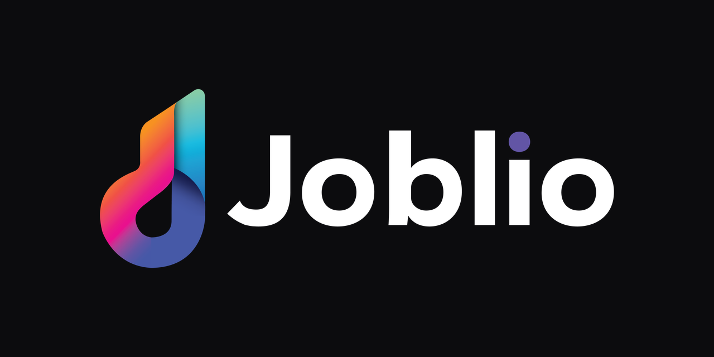

<p align="center">
  
</p>

<p align="center">
  <strong>Windows job tracker for sign shops.</strong><br>
  New → Design → Production → Install / Collection.<br>
  Runs on one PC. No cloud, no server, no account to sign up.
</p>

<p align="center">
  <a href="https://github.com/MitchellPel/Joblio/releases/latest"></a>
  <a href="LICENSE"></a>
  
  <a href="CONTRIBUTING.md"></a>
</p>

<p align="center">
  <a href="https://github.com/MitchellPel/Joblio/releases/latest"><strong>Download the installer</strong></a>
  ·
  <a href="#run-from-source">Run from source</a>
  ·
  <a href="CONTRIBUTING.md">Contribute</a>
</p>

---

Joblio is a **desktop app**, not a website. Staff install it like any other Windows program. Jobs live in a SQLite file on that PC, or in a shared folder so the whole shop sees the same board.

## Download

1. Get [**Joblio Setup**](https://github.com/MitchellPel/Joblio/releases/latest) (`.exe`).
2. Install and open Joblio.
3. Choose **Start on this PC**.
4. Log in: `admin` / `admin123` — then change that password.

A home or laptop copy does not need an office network. If the shop update share is missing, Joblio skips it instead of erroring.

Shop PCs that already share a `jobs.db` keep using **Use shared folder** and **Restart & Install** from the office update path.

## What you get

- **Kanban board** — drag jobs through New, Design, Production, Install, Collection, Completed
- **One PC or a team** — local database, or one `jobs.db` on a network share
- **People and audit** — logins, roles, notes, stage history with who and when
- **Proofs, calendar, cut / print list** — the shop tools we actually use
- **Out of the office** — optional Docker self-host; LAN in the shop, ngrok-style tunnel when away (URLs in `.env.selfhost`, not hardcoded)
- **Joblio AI** — admin picks Off, Local (Ollama), or Cloud (OpenAI-compatible). Early; not required to run the board
- **Offline board** — no hosting required to try jobs on one PC

## Out of the office (self-host + tunnel)

Joblio can talk to a shop **Docker** stack (Postgres) instead of a local `jobs.db`. On the LAN that is a normal URL. **Away from the office** we used a public tunnel (**ngrok** or similar) so login and the board still work.

Those URLs and keys live in `.env.selfhost` or a share file — they are **not** hardcoded. Copy [`.env.example`](.env.example) and set your own LAN URL and tunnel. See [`self-host/README.md`](self-host/README.md).

## Joblio AI (early)

AI is started, not finished. An **admin** chooses in Settings:

- **Off**
- **Local (Ollama)** — URL + model on this PC or a shop server
- **Cloud** — OpenAI-compatible URL, model, and API key (key stays on that PC)

Older shop installs can still read `joblio-ollama.json` on the share until an admin saves a choice in Settings.

Optional office Postgres/Docker stack: [`self-host/`](self-host/README.md).

## Run from source

Windows 10/11, [Node.js 20+](https://nodejs.org/).

```bash
git clone https://github.com/MitchellPel/Joblio.git
cd Joblio
npm install
npm run dev
```

Same first-run choice: **Start on this PC**. Installer build: `npm run dist`.

## Contributing

We want help making Joblio great — bugs, polish, docs, and ideas are all useful.

Please read **[CONTRIBUTING.md](CONTRIBUTING.md)** before a big change. Open an [issue](https://github.com/MitchellPel/Joblio/issues) if you are unsure where to start.

Good first directions:

- Contrast and small-window layout (shop laptops, no GPU)
- Bugs you can reproduce on one PC
- README / comments that help the next person
- Tests around login, board, and setup

Please do **not** copy code from `Reference Program/` if you have a local clone — that tree is AGPL learning-only and is not part of Joblio.

## Team (shared folder)

On setup, pick **Use shared folder** and point every PC at the same `jobs.db`. Every machine must be able to read and write that path.

## Project layout

```
electron/     Main process — SQLite, IPC, Windows shell
src/          React UI (Vite + Tailwind)
self-host/    Optional Docker Postgres for a shop server
```

Data access is Electron IPC (`window.tracker.*`), not a web API. Details for adding tables and stages: [CONTRIBUTING.md](CONTRIBUTING.md).

## Tech

Electron 32 · React 18 · TypeScript · Tailwind · sql.js (SQLite) · electron-builder (NSIS)

## License

[Apache License 2.0](LICENSE). The Joblio name and logo are marks of the project; the license does not grant a trademark right to rebrand the app as your own product.
